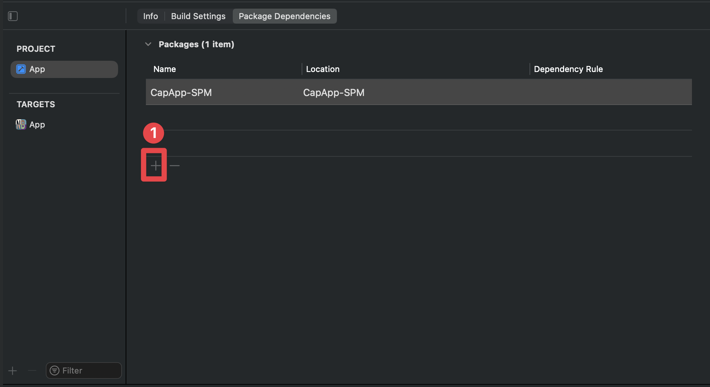
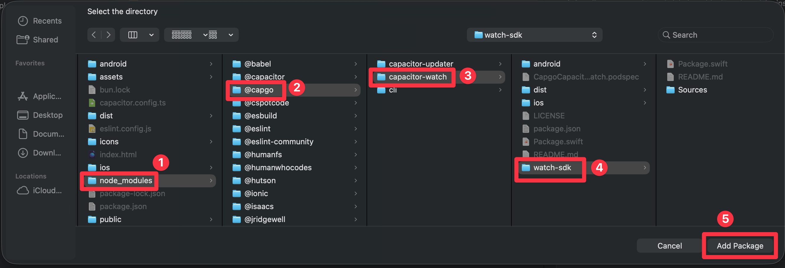
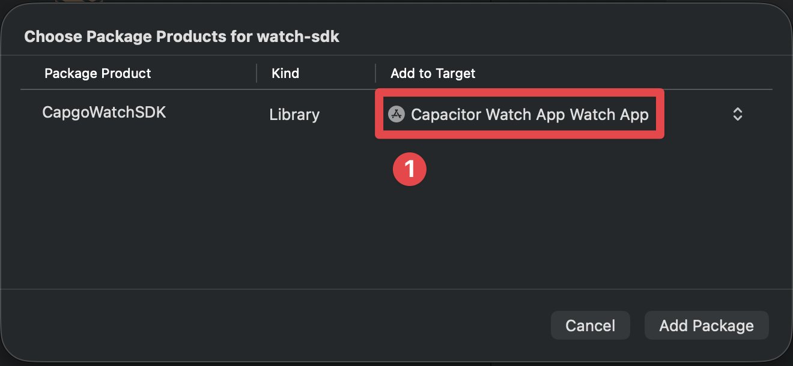
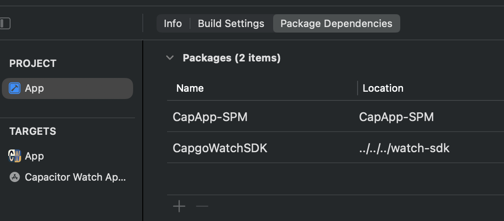
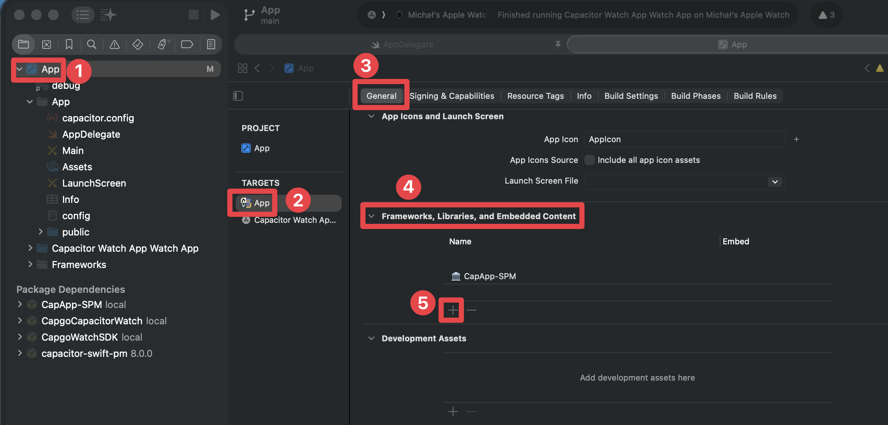
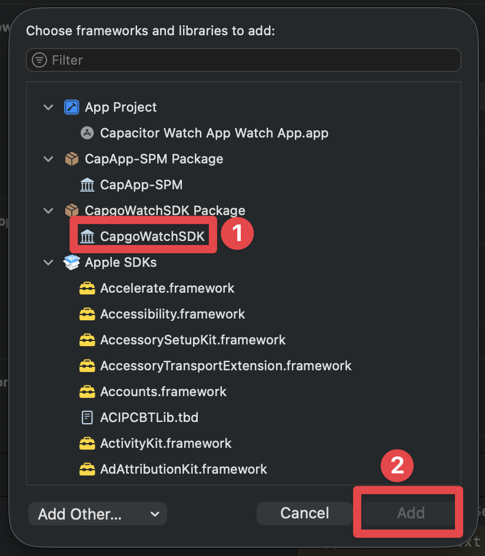

# @capgo/capacitor-watch
 <a href="https://capgo.app/"></a>

<div align="center">
  <h2><a href="https://capgo.app/?ref=plugin_watch"> ➡️ Get Instant updates for your App with Capgo</a></h2>
  <h2><a href="https://capgo.app/consulting/?ref=plugin_watch"> Missing a feature? We'll build the plugin for you 💪</a></h2>
</div>

Apple Watch communication plugin for Capacitor with bidirectional messaging support.

## Why Capacitor Watch?

The only Capacitor 8 compatible plugin for **bidirectional Apple Watch communication**:

- **Two-way messaging** - Send and receive messages between iPhone and Apple Watch
- **Application context** - Sync app state with latest-value-only semantics
- **User info transfers** - Reliable queued delivery even when watch is offline
- **Request/Reply pattern** - Interactive workflows with callback-based responses
- **SwiftUI ready** - Includes watch-side SDK with ObservableObject support
- **iOS 15+** - Built for modern iOS with Swift Package Manager

Essential for health apps, fitness trackers, remote controls, and any app extending to Apple Watch.

## Documentation

The most complete doc is available here: https://capgo.app/docs/plugins/watch/

## Install

```bash
npm install @capgo/capacitor-watch
npx cap sync
```

## Requirements

- **iOS**: iOS 15.0+ (Capacitor 8 minimum). Requires WatchConnectivity capability.
- **watchOS**: watchOS 9.0+. Requires companion app with CapgoWatchSDK.
- **Android**: Not supported (Apple Watch is iOS-only). Methods return appropriate errors.
- **Hardware**: Real Apple Watch required - simulators do not support WatchConnectivity.

---

## Complete Setup Tutorial

This tutorial walks you through setting up bidirectional communication between your Capacitor app and Apple Watch. Follow each step carefully.

### Step 1: Install the Plugin

First, add the plugin to your Capacitor project:

```bash
npm install @capgo/capacitor-watch
npx cap sync ios
```

Then open your iOS project in Xcode:

```bash
npx cap open ios
```

### Step 2: Add iOS App Capabilities

Your iOS app needs specific capabilities to communicate with Apple Watch.

1. Select your **App target** in Xcode (not the project)
2. Go to the **Signing & Capabilities** tab
3. Click the **+ Capability** button


4. Add the following capabilities:
   - **Background Modes** - Enable "Background fetch" and "Remote notifications"
   - **Push Notifications** (required for background wake)

Your capabilities should look like this when complete:


### Step 3: Configure AppDelegate.swift

> [!NOTE] 
> For now this will not compile. This is fine, we will fix in later steps

```swift
import UIKit
import Capacitor
import WatchConnectivity
import CapgoWatchSDK

@UIApplicationMain
class AppDelegate: UIResponder, UIApplicationDelegate {

    var window: UIWindow?

    func application(_ application: UIApplication, didFinishLaunchingWithOptions launchOptions: [UIApplication.LaunchOptionsKey: Any]?) -> Bool {
        // Initialize WatchConnectivity session
        if WCSession.isSupported() {
            WCSession.default.delegate = CapWatchSessionDelegate.shared
            WCSession.default.activate()
        }
        return true
    }

    // ... rest of your AppDelegate code
}
```

### Step 4: Create the Watch App Target

Now create the watchOS companion app:

1. In Xcode, go to **File > New > Target**
2. Select **watchOS** tab
3. Choose **App** and click Next


4. Configure the watch app:
   - **Product Name**: Your app name (e.g., "MyApp Watch")
   - **Bundle Identifier**: Must follow the pattern `[your-app-bundle-id].watchkitapp`
     - Example: If your app is `com.example.myapp`, use `com.example.myapp.watchkitapp`
   - **Language**: Swift
   - **User Interface**: SwiftUI


### Step 5: Add the CapgoWatchSDK Package

The watch app needs our SDK to communicate with the phone. Add it as a Swift Package:

1. Select your **project** in the navigator (top level, blue icon)
2. Go to **Package Dependencies** tab
3. Click the **+** button to add a package


4. Click on the plus button to add a package



5. Click **Add Package**




6. When prompted, select **CapgoWatchSDK** and add it to your **Watch App target** (not the main app)



After adding, your package dependencies should show the CapgoWatchSDK:



### Step 6: Fix the build for main app

Right now, your main app is missing the CapgoWatchSDK. We need to add it to the main app.

1. Select your project in the navigator (top level, blue icon)
2. Go to your iOS app target
3. Go to `general`
4. Scroll to `Frameworks, Libraries, and Embedded Content`
5. Click the plus button to add a framework



7. Click on the `CapgoWatchSDK` framework and click `Add`



### Step 6: Configure the Watch App

Update your watch app's main file to initialize the connection:

**MyAppWatch/MyAppWatchApp.swift:**

```swift
import SwiftUI
import WatchConnectivity
import CapgoWatchSDK

@main
struct MyAppWatchApp: App {
    init() {
        // Activate the watch connector
        WatchConnector.shared.activate()
    }

    var body: some Scene {
        WindowGroup {
            ContentView()
        }
    }
}
```

**MyAppWatch/ContentView.swift:**

```swift
import SwiftUI
import CapgoWatchSDK

struct ContentView: View {
    @ObservedObject var connector = WatchConnector.shared

    var body: some View {
        VStack(spacing: 20) {
            // Connection status indicator
            HStack {
                Circle()
                    .fill(connector.isReachable ? Color.green : Color.red)
                    .frame(width: 12, height: 12)
                Text(connector.isReachable ? "Connected" : "Disconnected")
                    .font(.caption)
            }

            // Send message button
            Button("Send to Phone") {
                connector.sendMessage(["action": "buttonTapped", "timestamp": Date().timeIntervalSince1970]) { reply in
                    print("Phone replied: \(reply)")
                }
            }
            .disabled(!connector.isReachable)

            // Display received context
            if let context = connector.receivedContext {
                Text("Last update: \(context["status"] as? String ?? "none")")
                    .font(.caption2)
            }
        }
        .padding()
    }
}
```

Your watch app structure should look like this:


### Step 7: Add Watch App Capabilities

The watch app also needs background capabilities:

1. Select your **Watch App target** in Xcode
2. Go to **Signing & Capabilities** tab
3. Click **+ Capability**
4. Add **Background Modes**
5. Enable **Remote Notifications**


### Step 8: Use the Plugin in Your Capacitor App

Now set up the JavaScript side in your Capacitor app:

```typescript
import { Watch } from '@capgo/capacitor-watch';

// Check watch connectivity status
async function checkWatchStatus() {
  const info = await Watch.getInfo();
  console.log('Watch supported:', info.isSupported);
  console.log('Watch paired:', info.isPaired);
  console.log('Watch app installed:', info.isWatchAppInstalled);
  console.log('Watch reachable:', info.isReachable);
}

// Listen for messages from watch
Watch.addListener('messageReceived', (event) => {
  console.log('Message from watch:', event.message);
  // Handle the message (e.g., event.message.action === 'buttonTapped')
});

// Listen for messages that need a reply
Watch.addListener('messageReceivedWithReply', async (event) => {
  console.log('Watch asking:', event.message);

  // Send reply back to watch
  await Watch.replyToMessage({
    callbackId: event.callbackId,
    data: { response: 'acknowledged', processed: true }
  });
});

// Listen for connection changes
Watch.addListener('reachabilityChanged', (event) => {
  console.log('Watch reachable:', event.isReachable);
  // Update UI to show connection status
});

// Send data to watch (latest value wins)
async function updateWatchContext(data: Record<string, unknown>) {
  await Watch.updateApplicationContext({ context: data });
}

// Send message to watch (requires watch to be reachable)
async function sendMessageToWatch(data: Record<string, unknown>) {
  await Watch.sendMessage({ data });
}

// Queue data for reliable delivery (even when watch is offline)
async function queueDataForWatch(data: Record<string, unknown>) {
  await Watch.transferUserInfo({ userInfo: data });
}
```

### Step 9: Build and Run

Use the target dropdown in Xcode to switch between building for your phone or watch:


**Build order:**
1. First, build and run the **iOS App** on your iPhone
2. Then, build and run the **Watch App** on your Apple Watch

**Important Notes:**
- You must use real devices - simulators do not support WatchConnectivity
- Both apps must be running for bidirectional communication
- The watch app will show "Disconnected" until the phone app is active

---

## Communication Methods

Choose the right method for your use case:

| Method | Use Case | Delivery | Watch Must Be Reachable |
|--------|----------|----------|-------------------------|
| `sendMessage()` | Real-time interaction | Immediate | Yes |
| `updateApplicationContext()` | Sync app state | Latest value only | No |
| `transferUserInfo()` | Important data | Queued, in order | No |

### Example: Complete Communication Flow

```typescript
import { Watch } from '@capgo/capacitor-watch';

class WatchService {
  private isReachable = false;

  async initialize() {
    // Check initial status
    const info = await Watch.getInfo();
    this.isReachable = info.isReachable;

    // Monitor reachability
    Watch.addListener('reachabilityChanged', (event) => {
      this.isReachable = event.isReachable;
    });

    // Handle incoming messages
    Watch.addListener('messageReceived', (event) => {
      this.handleWatchMessage(event.message);
    });

    // Handle request/reply messages
    Watch.addListener('messageReceivedWithReply', async (event) => {
      const reply = await this.processWatchRequest(event.message);
      await Watch.replyToMessage({
        callbackId: event.callbackId,
        data: reply
      });
    });
  }

  async syncAppState(state: Record<string, unknown>) {
    // Always works - queues if watch is unreachable
    await Watch.updateApplicationContext({ context: state });
  }

  async sendInteractiveMessage(data: Record<string, unknown>) {
    if (!this.isReachable) {
      console.log('Watch not reachable, queueing message');
      await Watch.transferUserInfo({ userInfo: data });
      return;
    }
    await Watch.sendMessage({ data });
  }

  private handleWatchMessage(message: Record<string, unknown>) {
    // Process message from watch
    console.log('Watch action:', message.action);
  }

  private async processWatchRequest(message: Record<string, unknown>) {
    // Process and return reply
    return { status: 'ok', timestamp: Date.now() };
  }
}
```

---

## SwiftUI Watch App Examples

### Basic Watch UI


### Advanced Watch App with Data Display

```swift
import SwiftUI
import CapgoWatchSDK

struct ContentView: View {
    @ObservedObject var connector = WatchConnector.shared
    @State private var lastMessage = "No messages yet"

    var body: some View {
        ScrollView {
            VStack(spacing: 16) {
                // Status header
                StatusView(isConnected: connector.isReachable)

                Divider()

                // Action buttons
                Button("Request Data") {
                    connector.sendMessage(["action": "requestData"]) { reply in
                        if let status = reply["status"] as? String {
                            lastMessage = "Got: \(status)"
                        }
                    }
                }
                .buttonStyle(.borderedProminent)
                .disabled(!connector.isReachable)

                Button("Send Tap") {
                    connector.sendMessage(["action": "tap", "time": Date().timeIntervalSince1970])
                }
                .disabled(!connector.isReachable)

                Divider()

                // Message display
                Text(lastMessage)
                    .font(.caption)
                    .foregroundColor(.secondary)
            }
            .padding()
        }
    }
}

struct StatusView: View {
    let isConnected: Bool

    var body: some View {
        HStack {
            Image(systemName: isConnected ? "iphone.radiowaves.left.and.right" : "iphone.slash")
                .foregroundColor(isConnected ? .green : .red)
            Text(isConnected ? "Phone Connected" : "Phone Disconnected")
                .font(.caption)
        }
    }
}
```

## API

<docgen-index>

* [`sendMessage(...)`](#sendmessage)
* [`updateApplicationContext(...)`](#updateapplicationcontext)
* [`transferUserInfo(...)`](#transferuserinfo)
* [`replyToMessage(...)`](#replytomessage)
* [`getInfo()`](#getinfo)
* [`getPluginVersion()`](#getpluginversion)
* [`addListener('messageReceived', ...)`](#addlistenermessagereceived-)
* [`addListener('messageReceivedWithReply', ...)`](#addlistenermessagereceivedwithreply-)
* [`addListener('applicationContextReceived', ...)`](#addlistenerapplicationcontextreceived-)
* [`addListener('userInfoReceived', ...)`](#addlisteneruserinforeceived-)
* [`addListener('reachabilityChanged', ...)`](#addlistenerreachabilitychanged-)
* [`addListener('activationStateChanged', ...)`](#addlisteneractivationstatechanged-)
* [`removeAllListeners()`](#removealllisteners)
* [Interfaces](#interfaces)
* [Type Aliases](#type-aliases)

</docgen-index>

<docgen-api>
<!--Update the source file JSDoc comments and rerun docgen to update the docs below-->

Apple Watch communication plugin for Capacitor.
Provides bidirectional messaging between iPhone and Apple Watch using WatchConnectivity.

### sendMessage(...)

```typescript
sendMessage(options: SendMessageOptions) => Promise<void>
```

Send an interactive message to the watch.
The watch must be reachable for this to succeed.
Use this for time-sensitive, interactive communication.

| Param         | Type                                                              | Description           |
| ------------- | ----------------------------------------------------------------- | --------------------- |
| **`options`** | <code><a href="#sendmessageoptions">SendMessageOptions</a></code> | - The message options |

**Since:** 8.0.0

--------------------


### updateApplicationContext(...)

```typescript
updateApplicationContext(options: UpdateContextOptions) => Promise<void>
```

Update the application context shared with the watch.
Only the latest context is kept - this overwrites any previous context.
Use this for syncing app state that the watch needs to display.

| Param         | Type                                                                  | Description           |
| ------------- | --------------------------------------------------------------------- | --------------------- |
| **`options`** | <code><a href="#updatecontextoptions">UpdateContextOptions</a></code> | - The context options |

**Since:** 8.0.0

--------------------


### transferUserInfo(...)

```typescript
transferUserInfo(options: TransferUserInfoOptions) => Promise<void>
```

Transfer user info to the watch.
Transfers are queued and delivered in order, even if the watch is not currently reachable.
Use this for important data that must be delivered reliably.

| Param         | Type                                                                        | Description             |
| ------------- | --------------------------------------------------------------------------- | ----------------------- |
| **`options`** | <code><a href="#transferuserinfooptions">TransferUserInfoOptions</a></code> | - The user info options |

**Since:** 8.0.0

--------------------


### replyToMessage(...)

```typescript
replyToMessage(options: ReplyMessageOptions) => Promise<void>
```

Reply to a message from the watch that requested a reply.
Use this in response to the messageReceivedWithReply event.

| Param         | Type                                                                | Description                                  |
| ------------- | ------------------------------------------------------------------- | -------------------------------------------- |
| **`options`** | <code><a href="#replymessageoptions">ReplyMessageOptions</a></code> | - The reply options including the callbackId |

**Since:** 8.0.0

--------------------


### getInfo()

```typescript
getInfo() => Promise<WatchInfo>
```

Get information about the watch connectivity status.

**Returns:** <code>Promise&lt;<a href="#watchinfo">WatchInfo</a>&gt;</code>

**Since:** 8.0.0

--------------------


### getPluginVersion()

```typescript
getPluginVersion() => Promise<{ version: string; }>
```

Get the native Capacitor plugin version.

**Returns:** <code>Promise&lt;{ version: string; }&gt;</code>

**Since:** 8.0.0

--------------------


### addListener('messageReceived', ...)

```typescript
addListener(eventName: 'messageReceived', listenerFunc: (event: MessageReceivedEvent) => void) => Promise<PluginListenerHandle>
```

Listen for messages received from the watch.

| Param              | Type                                                                                      | Description         |
| ------------------ | ----------------------------------------------------------------------------------------- | ------------------- |
| **`eventName`**    | <code>'messageReceived'</code>                                                            | - The event name    |
| **`listenerFunc`** | <code>(event: <a href="#messagereceivedevent">MessageReceivedEvent</a>) =&gt; void</code> | - Callback function |

**Returns:** <code>Promise&lt;<a href="#pluginlistenerhandle">PluginListenerHandle</a>&gt;</code>

**Since:** 8.0.0

--------------------


### addListener('messageReceivedWithReply', ...)

```typescript
addListener(eventName: 'messageReceivedWithReply', listenerFunc: (event: MessageReceivedWithReplyEvent) => void) => Promise<PluginListenerHandle>
```

Listen for messages from the watch that require a reply.

| Param              | Type                                                                                                        | Description         |
| ------------------ | ----------------------------------------------------------------------------------------------------------- | ------------------- |
| **`eventName`**    | <code>'messageReceivedWithReply'</code>                                                                     | - The event name    |
| **`listenerFunc`** | <code>(event: <a href="#messagereceivedwithreplyevent">MessageReceivedWithReplyEvent</a>) =&gt; void</code> | - Callback function |

**Returns:** <code>Promise&lt;<a href="#pluginlistenerhandle">PluginListenerHandle</a>&gt;</code>

**Since:** 8.0.0

--------------------


### addListener('applicationContextReceived', ...)

```typescript
addListener(eventName: 'applicationContextReceived', listenerFunc: (event: ContextReceivedEvent) => void) => Promise<PluginListenerHandle>
```

Listen for application context updates from the watch.

| Param              | Type                                                                                      | Description         |
| ------------------ | ----------------------------------------------------------------------------------------- | ------------------- |
| **`eventName`**    | <code>'applicationContextReceived'</code>                                                 | - The event name    |
| **`listenerFunc`** | <code>(event: <a href="#contextreceivedevent">ContextReceivedEvent</a>) =&gt; void</code> | - Callback function |

**Returns:** <code>Promise&lt;<a href="#pluginlistenerhandle">PluginListenerHandle</a>&gt;</code>

**Since:** 8.0.0

--------------------


### addListener('userInfoReceived', ...)

```typescript
addListener(eventName: 'userInfoReceived', listenerFunc: (event: UserInfoReceivedEvent) => void) => Promise<PluginListenerHandle>
```

Listen for user info transfers from the watch.

| Param              | Type                                                                                        | Description         |
| ------------------ | ------------------------------------------------------------------------------------------- | ------------------- |
| **`eventName`**    | <code>'userInfoReceived'</code>                                                             | - The event name    |
| **`listenerFunc`** | <code>(event: <a href="#userinforeceivedevent">UserInfoReceivedEvent</a>) =&gt; void</code> | - Callback function |

**Returns:** <code>Promise&lt;<a href="#pluginlistenerhandle">PluginListenerHandle</a>&gt;</code>

**Since:** 8.0.0

--------------------


### addListener('reachabilityChanged', ...)

```typescript
addListener(eventName: 'reachabilityChanged', listenerFunc: (event: ReachabilityChangedEvent) => void) => Promise<PluginListenerHandle>
```

Listen for watch reachability changes.

| Param              | Type                                                                                              | Description         |
| ------------------ | ------------------------------------------------------------------------------------------------- | ------------------- |
| **`eventName`**    | <code>'reachabilityChanged'</code>                                                                | - The event name    |
| **`listenerFunc`** | <code>(event: <a href="#reachabilitychangedevent">ReachabilityChangedEvent</a>) =&gt; void</code> | - Callback function |

**Returns:** <code>Promise&lt;<a href="#pluginlistenerhandle">PluginListenerHandle</a>&gt;</code>

**Since:** 8.0.0

--------------------


### addListener('activationStateChanged', ...)

```typescript
addListener(eventName: 'activationStateChanged', listenerFunc: (event: ActivationStateChangedEvent) => void) => Promise<PluginListenerHandle>
```

Listen for session activation state changes.

| Param              | Type                                                                                                    | Description         |
| ------------------ | ------------------------------------------------------------------------------------------------------- | ------------------- |
| **`eventName`**    | <code>'activationStateChanged'</code>                                                                   | - The event name    |
| **`listenerFunc`** | <code>(event: <a href="#activationstatechangedevent">ActivationStateChangedEvent</a>) =&gt; void</code> | - Callback function |

**Returns:** <code>Promise&lt;<a href="#pluginlistenerhandle">PluginListenerHandle</a>&gt;</code>

**Since:** 8.0.0

--------------------


### removeAllListeners()

```typescript
removeAllListeners() => Promise<void>
```

Remove all listeners for this plugin.

**Since:** 8.0.0

--------------------


### Interfaces


#### SendMessageOptions

Options for sending a message to the watch.

| Prop       | Type                                                          | Description                                                                                               |
| ---------- | ------------------------------------------------------------- | --------------------------------------------------------------------------------------------------------- |
| **`data`** | <code><a href="#watchmessagedata">WatchMessageData</a></code> | The data to send to the watch. Must be serializable (string, number, boolean, arrays, or nested objects). |


#### UpdateContextOptions

Options for updating the application context.

| Prop          | Type                                                          | Description                                                                                                 |
| ------------- | ------------------------------------------------------------- | ----------------------------------------------------------------------------------------------------------- |
| **`context`** | <code><a href="#watchmessagedata">WatchMessageData</a></code> | The context data to sync with the watch. Only the latest context is kept - previous values are overwritten. |


#### TransferUserInfoOptions

Options for transferring user info.

| Prop           | Type                                                          | Description                                                                  |
| -------------- | ------------------------------------------------------------- | ---------------------------------------------------------------------------- |
| **`userInfo`** | <code><a href="#watchmessagedata">WatchMessageData</a></code> | The user info data to transfer. Transfers are queued and delivered in order. |


#### ReplyMessageOptions

Options for replying to a message from the watch.

| Prop             | Type                                                          | Description                                                     |
| ---------------- | ------------------------------------------------------------- | --------------------------------------------------------------- |
| **`callbackId`** | <code>string</code>                                           | The callback ID received in the messageReceivedWithReply event. |
| **`data`**       | <code><a href="#watchmessagedata">WatchMessageData</a></code> | The reply data to send back to the watch.                       |


#### WatchInfo

Information about Watch connectivity status.

| Prop                      | Type                 | Description                                                                                    |
| ------------------------- | -------------------- | ---------------------------------------------------------------------------------------------- |
| **`isSupported`**         | <code>boolean</code> | Whether WatchConnectivity is supported on this device. Always false on iPad, web, and Android. |
| **`isPaired`**            | <code>boolean</code> | Whether an Apple Watch is paired with this iPhone.                                             |
| **`isWatchAppInstalled`** | <code>boolean</code> | Whether the paired watch has the companion app installed.                                      |
| **`isReachable`**         | <code>boolean</code> | Whether the watch is currently reachable for immediate messaging.                              |
| **`activationState`**     | <code>number</code>  | The current activation state of the WCSession. 0 = notActivated, 1 = inactive, 2 = activated   |


#### PluginListenerHandle

| Prop         | Type                                      |
| ------------ | ----------------------------------------- |
| **`remove`** | <code>() =&gt; Promise&lt;void&gt;</code> |


#### MessageReceivedEvent

Event data for received messages.

| Prop          | Type                                                          | Description                               |
| ------------- | ------------------------------------------------------------- | ----------------------------------------- |
| **`message`** | <code><a href="#watchmessagedata">WatchMessageData</a></code> | The message data received from the watch. |


#### MessageReceivedWithReplyEvent

Event data for messages that require a reply.

| Prop             | Type                                                          | Description                                                 |
| ---------------- | ------------------------------------------------------------- | ----------------------------------------------------------- |
| **`message`**    | <code><a href="#watchmessagedata">WatchMessageData</a></code> | The message data received from the watch.                   |
| **`callbackId`** | <code>string</code>                                           | The callback ID to use when replying with replyToMessage(). |


#### ContextReceivedEvent

Event data for application context updates.

| Prop          | Type                                                          | Description                               |
| ------------- | ------------------------------------------------------------- | ----------------------------------------- |
| **`context`** | <code><a href="#watchmessagedata">WatchMessageData</a></code> | The context data received from the watch. |


#### UserInfoReceivedEvent

Event data for user info transfers.

| Prop           | Type                                                          | Description                                 |
| -------------- | ------------------------------------------------------------- | ------------------------------------------- |
| **`userInfo`** | <code><a href="#watchmessagedata">WatchMessageData</a></code> | The user info data received from the watch. |


#### ReachabilityChangedEvent

Event data for reachability changes.

| Prop              | Type                 | Description                         |
| ----------------- | -------------------- | ----------------------------------- |
| **`isReachable`** | <code>boolean</code> | Whether the watch is now reachable. |


#### ActivationStateChangedEvent

Event data for activation state changes.

| Prop        | Type                | Description                                                             |
| ----------- | ------------------- | ----------------------------------------------------------------------- |
| **`state`** | <code>number</code> | The new activation state. 0 = notActivated, 1 = inactive, 2 = activated |


### Type Aliases


#### WatchMessageData

Data that can be sent between iPhone and Apple Watch.
Values must be serializable (string, number, boolean, arrays, or nested objects).

<code><a href="#record">Record</a>&lt;string, unknown&gt;</code>


#### Record

Construct a type with a set of properties K of type T

<code>{
 [P in K]: T;
 }</code>

</docgen-api>

## Credits

Based on the enhanced WatchConnectivity implementation from [CapacitorWatchEnhanced](https://github.com/macsupport/CapacitorWatchEnhanced).
Who was a fork of the offical [CapacitorWatch](https://github.com/ionic-team/CapacitorWatch)
