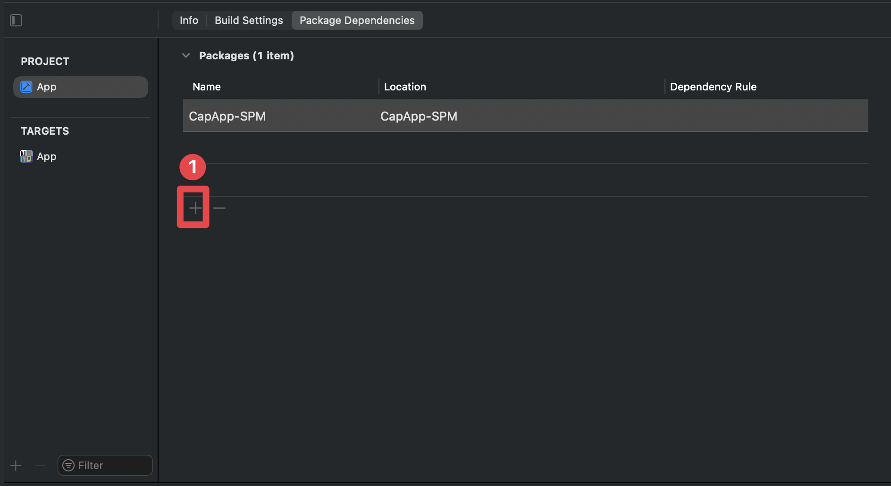
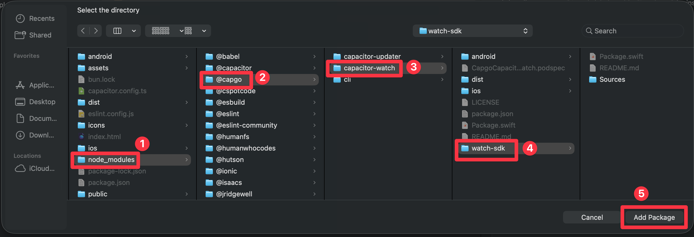
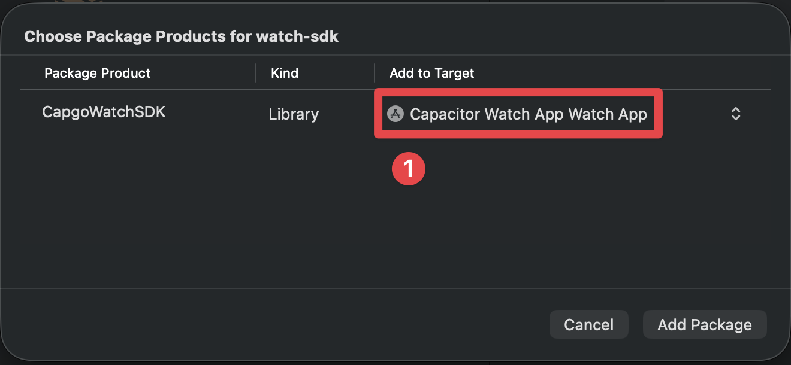
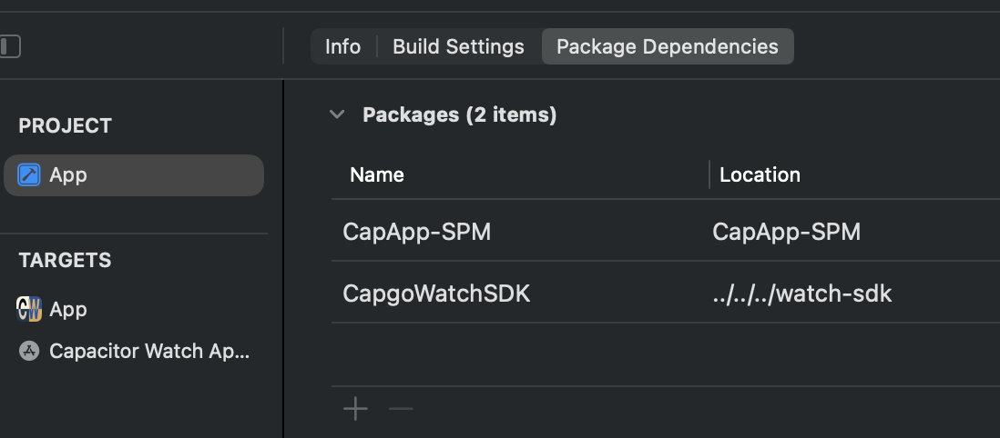
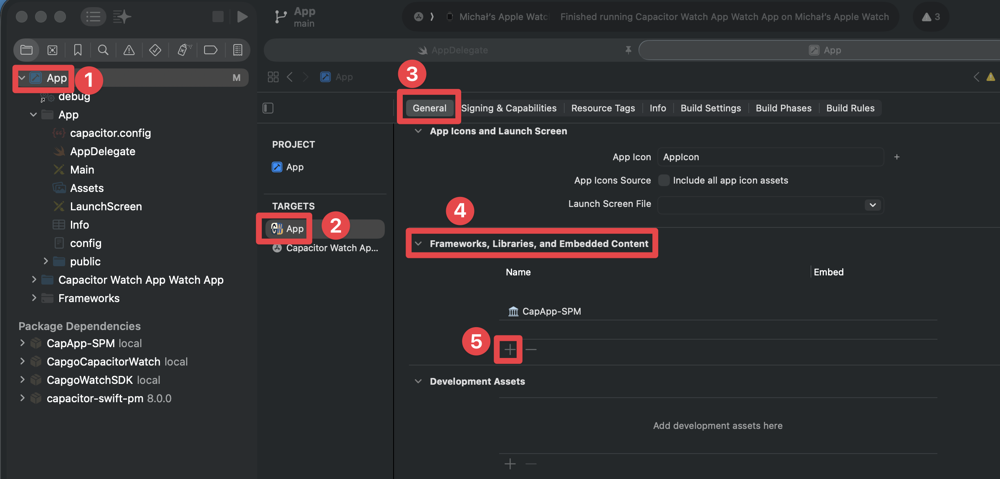
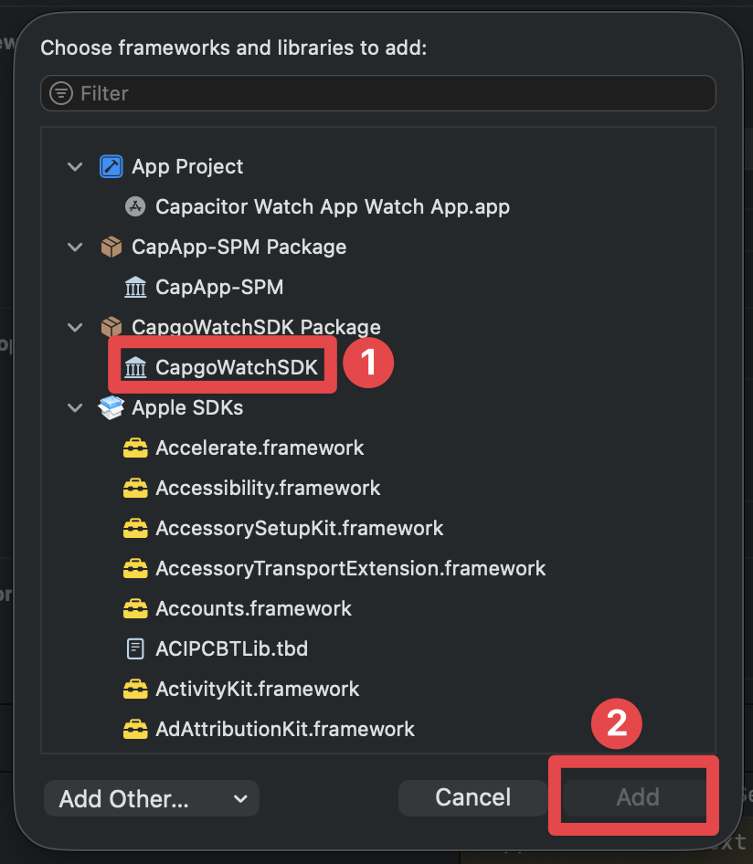

# Capacitor Watch: Apple Watch + Wear OS

**`@capgo/capacitor-watch`**: Capacitor 8 plugin for bidirectional phone and watch messaging on **iOS (Apple Watch)** and **Android (Wear OS)**.

<a href="https://capgo.app/"></a>

<div align="center">
  <h2><a href="https://capgo.app/?ref=plugin_watch"> ➡️ Get Instant updates for your App with Capgo</a></h2>
  <h2><a href="https://capgo.app/consulting/?ref=plugin_watch"> Missing a feature? We'll build the plugin for you 💪</a></h2>
</div>

## Features

- **Bidirectional messaging** between the phone app and a paired **Apple Watch** or **Wear OS** watch
- **Request/reply** flows (`messageReceivedWithReply` + `replyToMessage`) on both native platforms
- **Application context** sync with latest-value semantics (`updateApplicationContext` / `applicationContextReceived`)
- **User info transfers** for queued delivery (`transferUserInfo` / `userInfoReceived`)
- **Connectivity status** via `getInfo()` (pairing, reachability, companion app detection)
- **Apple Watch**: WatchConnectivity on iOS plus **CapgoWatchSDK** for watchOS (SwiftUI-friendly)
- **Wear OS**: Google Play services **Wearable Data Layer** (`play-services-wearable`) on Android

## Why Capacitor Watch?

The Capacitor 8 plugin for **bidirectional watch communication on iOS and Android**:

- **Two-way messaging** - Phone and Apple Watch (WatchConnectivity) and phone and Wear OS (Data Layer)
- **Application context** - Sync app state with latest-value-only semantics
- **User info transfers** - Reliable queued delivery when the watch is not immediately reachable
- **Request/reply pattern** - Interactive workflows with callback-based responses
- **SwiftUI ready** - Includes watch-side SDK with ObservableObject support for Apple Watch
- **Wear OS ready** - Documented Data Layer paths and capability name match the native Android implementation

Essential for health apps, fitness trackers, remote controls, and any Capacitor app that extends to Apple Watch or Wear OS.

## Documentation

The most complete doc is available here: https://capgo.app/docs/plugins/watch/

## Compatibility

| Plugin version | Capacitor compatibility | Maintained |
| -------------- | ----------------------- | ---------- |
| v8.\*.\*       | v8.\*.\*                | ✅          |
| v7.\*.\*       | v7.\*.\*                | On demand   |
| v6.\*.\*       | v6.\*.\*                | ❌          |
| v5.\*.\*       | v5.\*.\*                | ❌          |

> **Note:** The major version of this plugin follows the major version of Capacitor. Use the version that matches your Capacitor installation (e.g., plugin v8 for Capacitor 8). Only the latest major version is actively maintained.

## Install

You can use our AI-Assisted Setup to install the plugin. Add the Capgo skills to your AI tool using the following command:

```bash
npx skills add https://github.com/cap-go/capacitor-skills --skill capacitor-plugins
```

Then use the following prompt:

```text
Use the `capacitor-plugins` skill from `cap-go/capacitor-skills` to install the `@capgo/capacitor-watch` plugin in my project.
```

If you prefer Manual Setup, install the plugin by running the following commands and follow the platform-specific instructions below:

```bash
npm install @capgo/capacitor-watch
npx cap sync
```

## Requirements

- **iOS**: iOS 15.0+ (Capacitor 8 minimum). WatchConnectivity capability on the iPhone app.
- **watchOS**: watchOS 9.0+. Companion watch app with **CapgoWatchSDK** (see [Apple Watch setup guide](#apple-watch-setup-guide)).
- **Android (phone)**: API **24+** (`minSdkVersion` 24 in the plugin `android/build.gradle`). **Google Play services** with Wear OS support. A **paired Wear OS** device or emulator with the companion watch module installed.
- **Wear OS (watch module)**: Same **`applicationId`** as the phone app, signed with the same key. Gradle dependency `com.google.android.gms:play-services-wearable:18.2.0` (same version as the plugin). Advertise capability **`capgo_watch`** so `getInfo().isWatchAppInstalled` works.
- **Hardware**: Real Apple Watch recommended for iOS (simulators do not support WatchConnectivity). Wear OS can be tested on emulators with phone + watch pairing.

## Platform support

Methods and events below reflect the current **iOS** (`CapgoWatchPlugin.swift`), **Android** (`CapgoWatchPlugin.java`), and **Web** (`web.ts`) implementations.

| API | iOS / Apple Watch | Android / Wear OS | Web |
| --- | --- | --- | --- |
| `sendMessage` | Yes. Watch must be **reachable** (`WCSession.isReachable`). | Yes. Sends on MessageClient path `/capgo/message` to **all connected** nodes; rejects if none. Does not mirror iOS reachability checks before send. | Throws `unavailable` |
| `updateApplicationContext` | Yes. `WCSession.updateApplicationContext`. | Yes. DataItem path `/capgo/context`, map key `payload` (JSON string). | Throws `unavailable` |
| `transferUserInfo` | Yes. Queued `transferUserInfo`. | Yes. DataItem path `/capgo/userinfo/{uuid}`, map key `payload`. | Throws `unavailable` |
| `replyToMessage` | Yes. Completes the WatchConnectivity reply handler. | Yes. MessageClient path `/capgo/reply/{callbackId}` to the originating node. Pending replies expire after **5 minutes**. | Throws `unavailable` |
| `getInfo` | Yes. WCSession pairing, install, reachability, activation. | Yes. Connected nodes, capability **`capgo_watch`**, `activationState` **2** if any node connected else **0**. Returns unsupported defaults if Play services fails. | Always unsupported defaults |
| `getPluginVersion` | Yes | Yes | Yes (`version: "web"`) |
| `messageReceived` | Yes | Yes. Incoming `/capgo/message` (JSON body). | Listener API only; no events |
| `messageReceivedWithReply` | Yes | Yes. Incoming `/capgo/message/withreply`; phone generates `callbackId`. | Listener API only; no events |
| `applicationContextReceived` | Yes | Yes. DataItem `/capgo/context`. | Listener API only; no events |
| `userInfoReceived` | Yes | Yes. DataItem `/capgo/userinfo/*`; phone **deletes** the item after handling. | Listener API only; no events |
| `reachabilityChanged` | Yes | **Not emitted** (poll `getInfo()`). | **Not emitted** |
| `activationStateChanged` | Yes (WCSession states 0/1/2) | **Not emitted** | **Not emitted** |

**Wear OS Data Layer paths** (phone plugin and watch app must use the same strings):

| Path | Direction | Mechanism |
| --- | --- | --- |
| `/capgo/message` | Both ways | `MessageClient` one-way JSON payload |
| `/capgo/message/withreply` | Watch → phone (typical) | `MessageClient`; phone replies with `replyToMessage` on `/capgo/reply/{callbackId}` |
| `/capgo/reply/{callbackId}` | Phone → watch | `MessageClient` JSON reply |
| `/capgo/context` | Both ways | `DataClient` DataItem, field `payload` |
| `/capgo/userinfo/{uuid}` | Both ways | `DataClient` DataItem, field `payload` |

---

## Apple Watch setup guide

This tutorial walks you through setting up bidirectional communication between your Capacitor app and Apple Watch. Follow each step carefully.

### Step 1: Install the Plugin

First, add the plugin to your Capacitor project:

```bash
npm install @capgo/capacitor-watch
npx cap sync ios
```

Then open your iOS project in Xcode:

```bash
npx cap open ios
```

### Step 2: Add iOS App Capabilities

Your iOS app needs specific capabilities to communicate with Apple Watch.

1. Select your **App target** in Xcode (not the project)
2. Go to the **Signing & Capabilities** tab
3. Click the **+ Capability** button


4. Add the following capabilities:
   - **Background Modes** - Enable "Background fetch" and "Remote notifications"
   - **Push Notifications** (required for background wake)

Your capabilities should look like this when complete:


### Step 3: Configure AppDelegate.swift

The Capacitor plugin owns WatchConnectivity on the phone: when `@capgo/capacitor-watch` loads, it sets the `WCSession` delegate and calls `activate()`. **Do not** assign `WCSession.default.delegate` or call `activate()` in your iOS app; doing so can break plugin messaging.

Your phone app's `AppDelegate` only needs the usual Capacitor setup (no WatchConnectivity imports or session code):

```swift
import UIKit
import Capacitor

@UIApplicationMain
class AppDelegate: UIResponder, UIApplicationDelegate {

    var window: UIWindow?

    func application(_ application: UIApplication, didFinishLaunchingWithOptions launchOptions: [UIApplication.LaunchOptionsKey: Any]?) -> Bool {
        return true
    }

    // ... rest of your AppDelegate code
}
```

### Step 4: Create the Watch App Target

Now create the watchOS companion app:

1. In Xcode, go to **File > New > Target**
2. Select **watchOS** tab
3. Choose **App** and click Next


4. Configure the watch app:
   - **Product Name**: Your app name (e.g., "MyApp Watch")
   - **Bundle Identifier**: Must follow the pattern `[your-app-bundle-id].watchkitapp`
     - Example: If your app is `com.example.myapp`, use `com.example.myapp.watchkitapp`
   - **Language**: Swift
   - **User Interface**: SwiftUI


### Step 5: Add the CapgoWatchSDK Package

The watch app needs our SDK to communicate with the phone. Add it as a Swift Package:

1. Select your **project** in the navigator (top level, blue icon)
2. Go to **Package Dependencies** tab
3. Click the **+** button to add a package


4. Click on the plus button to add a package



5. Click **Add Package**




6. When prompted, select **CapgoWatchSDK** and add it to your **Watch App target** (not the main app)



After adding, your package dependencies should show the CapgoWatchSDK:



### Step 6: Fix the build for main app

Right now, your main app is missing the CapgoWatchSDK. We need to add it to the main app.

1. Select your project in the navigator (top level, blue icon)
2. Go to your iOS app target
3. Go to `general`
4. Scroll to `Frameworks, Libraries, and Embedded Content`
5. Click the plus button to add a framework



7. Click on the `CapgoWatchSDK` framework and click `Add`



### Step 7: Configure the Watch App

Update your watch app's main file to initialize the connection:

**MyAppWatch/MyAppWatchApp.swift:**

```swift
import SwiftUI
import WatchConnectivity
import CapgoWatchSDK

@main
struct MyAppWatchApp: App {
    init() {
        // Activate the watch connector
        WatchConnector.shared.activate()
    }

    var body: some Scene {
        WindowGroup {
            ContentView()
        }
    }
}
```

**MyAppWatch/ContentView.swift:**

```swift
import SwiftUI
import CapgoWatchSDK

struct ContentView: View {
    @ObservedObject var connector = WatchConnector.shared

    var body: some View {
        VStack(spacing: 20) {
            // Connection status indicator
            HStack {
                Circle()
                    .fill(connector.isReachable ? Color.green : Color.red)
                    .frame(width: 12, height: 12)
                Text(connector.isReachable ? "Connected" : "Disconnected")
                    .font(.caption)
            }

            // Send message button
            Button("Send to Phone") {
                connector.sendMessage(["action": "buttonTapped", "timestamp": Date().timeIntervalSince1970]) { reply in
                    print("Phone replied: \(reply)")
                }
            }
            .disabled(!connector.isReachable)

            // Display received context
            if let context = connector.receivedContext {
                Text("Last update: \(context["status"] as? String ?? "none")")
                    .font(.caption2)
            }
        }
        .padding()
    }
}
```

Your watch app structure should look like this:


### Step 8: Add Watch App Capabilities

The watch app also needs background capabilities:

1. Select your **Watch App target** in Xcode
2. Go to **Signing & Capabilities** tab
3. Click **+ Capability**
4. Add **Background Modes**
5. Enable **Remote Notifications**


### Step 9: Use the Plugin in Your Capacitor App

Now set up the JavaScript side in your Capacitor app:

```typescript
import { CapgoWatch } from '@capgo/capacitor-watch';

// Check watch connectivity status
async function checkWatchStatus() {
  const info = await CapgoWatch.getInfo();
  console.log('Watch supported:', info.isSupported);
  console.log('Watch paired:', info.isPaired);
  console.log('Watch app installed:', info.isWatchAppInstalled);
  console.log('Watch reachable:', info.isReachable);
}

// Listen for messages from watch
CapgoWatch.addListener('messageReceived', (event) => {
  console.log('Message from watch:', event.message);
  // Handle the message (e.g., event.message.action === 'buttonTapped')
});

// Listen for messages that need a reply
CapgoWatch.addListener('messageReceivedWithReply', async (event) => {
  console.log('Watch asking:', event.message);

  // Send reply back to watch
  await CapgoWatch.replyToMessage({
    callbackId: event.callbackId,
    data: { response: 'acknowledged', processed: true }
  });
});

// Listen for connection changes
CapgoWatch.addListener('reachabilityChanged', (event) => {
  console.log('Watch reachable:', event.isReachable);
  // Update UI to show connection status
});

// Send data to watch (latest value wins)
async function updateWatchContext(data: Record<string, unknown>) {
  await CapgoWatch.updateApplicationContext({ context: data });
}

// Send message to watch (requires watch to be reachable)
async function sendMessageToWatch(data: Record<string, unknown>) {
  await CapgoWatch.sendMessage({ data });
}

// Queue data for reliable delivery (even when watch is offline)
async function queueDataForWatch(data: Record<string, unknown>) {
  await CapgoWatch.transferUserInfo({ userInfo: data });
}
```

### Step 10: Build and Run

Use the target dropdown in Xcode to switch between building for your phone or watch:


**Build order:**
1. First, build and run the **iOS App** on your iPhone
2. Then, build and run the **Watch App** on your Apple Watch

**Important Notes:**
- You must use real devices - simulators do not support WatchConnectivity
- Both apps must be running for bidirectional communication
- The watch app will show "Disconnected" until the phone app is active

---

## Wear OS setup guide

This guide mirrors the Apple Watch tutorial: add a **Wear OS module** to your existing Capacitor Android app, wire the same Data Layer paths the plugin uses on the phone, and call the plugin from TypeScript on the phone.

Full reference: [Capacitor Watch docs](https://capgo.app/docs/plugins/watch/).

### Step 1: Install the plugin on the phone app

```bash
npm install @capgo/capacitor-watch
npx cap sync android
```

Open the Android project:

```bash
npx cap open android
```

The Capacitor Android library already depends on `play-services-wearable` **18.2.0** (see the plugin `android/build.gradle`). You do **not** need to add that dependency to the phone module again unless you call Wear APIs directly from the phone app.

### Step 2: Create the Wear OS app module

1. In Android Studio, **File > New > New Module**.
2. Choose **Wear OS > Empty Wear App** (or **Wear OS app**).
3. Set **Application ID** to the **same `applicationId`** as your Capacitor `app` module (required for the Data Layer).
4. Use the **same signing config** as the phone app for release builds.

Example `wear/build.gradle.kts` dependencies (match the plugin version):

```kotlin
dependencies {
    implementation("com.google.android.gms:play-services-wearable:18.2.0")
}
```

The Wear module should target at least **minSdk 24** to align with the plugin.

### Step 3: Advertise the `capgo_watch` capability

The phone plugin calls `CapabilityClient.getCapability("capgo_watch", FILTER_ALL)` to set `isWatchAppInstalled`. Your watch app must advertise that capability.

`wear/src/main/res/values/wear.xml`:

```xml
<?xml version="1.0" encoding="utf-8"?>
<resources>
    <string-array name="android_wear_capabilities" translatable="false">
        <item>capgo_watch</item>
    </string-array>
</resources>
```

`wear/src/main/AndroidManifest.xml` (inside `<application>`):

```xml
<meta-data
    android:name="com.google.android.gms.wearable.CAPABILITIES"
    android:resource="@array/android_wear_capabilities" />
```

### Step 4: Register a Wearable listener for `/capgo` paths

Use a `WearableListenerService` so the watch receives messages and data items while the app is in the background.

`wear/src/main/AndroidManifest.xml`:

```xml
<service
    android:name=".CapgoWearListenerService"
    android:exported="true">
    <intent-filter>
        <action android:name="com.google.android.gms.wearable.MESSAGE_RECEIVED" />
        <data
            android:scheme="wear"
            android:host="*"
            android:pathPrefix="/capgo" />
    </intent-filter>
    <intent-filter>
        <action android:name="com.google.android.gms.wearable.DATA_CHANGED" />
        <data
            android:scheme="wear"
            android:host="*"
            android:pathPrefix="/capgo" />
    </intent-filter>
</service>
```

### Step 5: Watch-side Kotlin (listener + send/reply)

Constants must match `CapgoWatchPlugin.java` on the phone:

```kotlin
// CapgoWearPaths.kt
object CapgoWearPaths {
    const val CAPABILITY = "capgo_watch"
    const val MESSAGE = "/capgo/message"
    const val MESSAGE_WITH_REPLY = "/capgo/message/withreply"
    const val REPLY_PREFIX = "/capgo/reply/"
    const val CONTEXT = "/capgo/context"
    const val USER_INFO_PREFIX = "/capgo/userinfo/"
    const val PAYLOAD_KEY = "payload"
}
```

```kotlin
// CapgoWearListenerService.kt
package com.example.app.wear // use your wear module package

import com.google.android.gms.wearable.DataEvent
import com.google.android.gms.wearable.DataEventBuffer
import com.google.android.gms.wearable.DataMapItem
import com.google.android.gms.wearable.MessageEvent
import com.google.android.gms.wearable.Wearable
import com.google.android.gms.wearable.WearableListenerService
import org.json.JSONObject

class CapgoWearListenerService : WearableListenerService() {

    override fun onMessageReceived(messageEvent: MessageEvent) {
        val json = JSONObject(String(messageEvent.data, Charsets.UTF_8))
        when {
            messageEvent.path == CapgoWearPaths.MESSAGE -> {
                // One-way message from phone (or another node)
                handlePhoneMessage(json)
            }
            messageEvent.path.startsWith(CapgoWearPaths.REPLY_PREFIX) -> {
                // Reply from phone after watch sent MESSAGE_WITH_REPLY
                handleReplyFromPhone(json)
            }
        }
    }

    override fun onDataChanged(dataEvents: DataEventBuffer) {
        dataEvents.forEach { event ->
            if (event.type != DataEvent.TYPE_CHANGED) return@forEach
            val dataItem = event.dataItem
            val path = dataItem.uri.path ?: return@forEach
            val map = DataMapItem.fromDataItem(dataItem).dataMap
            val payload = JSONObject(map.getString(CapgoWearPaths.PAYLOAD_KEY, "{}"))
            when {
                path == CapgoWearPaths.CONTEXT -> handleContextFromPhone(payload)
                path.startsWith(CapgoWearPaths.USER_INFO_PREFIX) -> {
                    val localId = try {
                        com.google.android.gms.tasks.Tasks
                            .await(Wearable.getNodeClient(this).localNode).id
                    } catch (_: Exception) {
                        return@forEach
                    }
                    if (dataItem.uri.host == localId) return@forEach
                    handleUserInfoFromPhone(payload)
                    try {
                        com.google.android.gms.tasks.Tasks.await(
                            Wearable.getDataClient(this).deleteDataItems(dataItem.uri)
                        )
                    } catch (_: Exception) {
                        // Deletion failed; item may be redelivered. Retry delete or use WorkManager.
                    }
                }
            }
        }
    }

    private fun handlePhoneMessage(json: JSONObject) { /* update UI */ }
    private fun handleReplyFromPhone(json: JSONObject) { /* complete request */ }
    private fun handleContextFromPhone(json: JSONObject) { /* latest state */ }
    private fun handleUserInfoFromPhone(json: JSONObject) { /* queued payload */ }
}
```

**Send a one-way message to the phone** (watch → phone):

```kotlin
suspend fun sendToPhone(context: android.content.Context, data: JSONObject) {
    val nodeClient = Wearable.getNodeClient(context)
    val messageClient = Wearable.getMessageClient(context)
    val nodes = nodeClient.connectedNodes.await()
    val payload = data.toString().toByteArray(Charsets.UTF_8)
    nodes.forEach { node ->
        messageClient.sendMessage(node.id, CapgoWearPaths.MESSAGE, payload).await()
    }
}
```

**Request a reply from the phone** (watch → phone, phone uses `replyToMessage`):

```kotlin
suspend fun requestFromPhone(context: android.content.Context, data: JSONObject) {
    val messageClient = Wearable.getMessageClient(context)
    val nodes = Wearable.getNodeClient(context).connectedNodes.await()
    val payload = data.toString().toByteArray(Charsets.UTF_8)
    nodes.forEach { node ->
        messageClient.sendMessage(node.id, CapgoWearPaths.MESSAGE_WITH_REPLY, payload).await()
    }
    // Phone generates callbackId and later sends JSON on /capgo/reply/{callbackId}
    // Handle it in onMessageReceived when path.startsWith(REPLY_PREFIX)
}
```

**Push application context or user info to the phone** (same paths the plugin uses):

```kotlin
suspend fun syncContextToPhone(context: android.content.Context, data: JSONObject) {
    val request = com.google.android.gms.wearable.PutDataMapRequest.create(CapgoWearPaths.CONTEXT)
    request.dataMap.putString(CapgoWearPaths.PAYLOAD_KEY, data.toString())
    request.setUrgent()
    Wearable.getDataClient(context).putDataItem(request.asPutDataRequest()).await()
}

suspend fun transferUserInfoToPhone(context: android.content.Context, data: JSONObject) {
    val path = CapgoWearPaths.USER_INFO_PREFIX + java.util.UUID.randomUUID()
    val request = com.google.android.gms.wearable.PutDataMapRequest.create(path)
    request.dataMap.putString(CapgoWearPaths.PAYLOAD_KEY, data.toString())
    request.setUrgent()
    Wearable.getDataClient(context).putDataItem(request.asPutDataRequest()).await()
}
```

Use `kotlinx.coroutines.tasks.await` or `Tasks.await` on a background thread for the `.await()` calls above.

### Step 6: Phone-side TypeScript (Capacitor)

Use the same TypeScript import and methods as on iOS for messaging and context sync. Android does not emit `reachabilityChanged` or `activationStateChanged`. Import from `@capgo/capacitor-watch` in your Capacitor web code:

```typescript
import { CapgoWatch } from '@capgo/capacitor-watch';

export async function setupWearOsBridge() {
  const info = await CapgoWatch.getInfo();
  console.log('Wear supported:', info.isSupported);
  console.log('Node connected:', info.isPaired);
  console.log('Watch app (capgo_watch):', info.isWatchAppInstalled);

  CapgoWatch.addListener('messageReceived', (event) => {
    console.log('From watch:', event.message);
  });

  CapgoWatch.addListener('messageReceivedWithReply', async (event) => {
    await CapgoWatch.replyToMessage({
      callbackId: event.callbackId,
      data: { status: 'ok', echo: event.message },
    });
  });

  CapgoWatch.addListener('applicationContextReceived', (event) => {
    console.log('Context from watch:', event.context);
  });

  CapgoWatch.addListener('userInfoReceived', (event) => {
    console.log('User info from watch:', event.userInfo);
  });

  // Android does not emit reachabilityChanged; poll when needed:
  setInterval(async () => {
    const latest = await CapgoWatch.getInfo();
    console.log('Reachable:', latest.isReachable);
  }, 5000);
}

export async function sendToWatch(data: Record<string, unknown>) {
  await CapgoWatch.sendMessage({ data });
}

export async function syncState(context: Record<string, unknown>) {
  await CapgoWatch.updateApplicationContext({ context });
}
```

### Step 7: Build, deploy, and test

1. Install the **phone** APK on a physical device or phone emulator with Google Play.
2. Install the **wear** APK on a Wear OS emulator or watch (same `applicationId`).
3. Pair watch and phone (Wear OS companion app on a real device, or Android Studio **Wear OS Pairing** for emulators).
4. Open the Capacitor app on the phone so the plugin registers `MessageClient` / `DataClient` listeners.
5. Confirm `getInfo()` reports `isWatchAppInstalled: true` after the watch app advertises `capgo_watch`.

**Testing tips**

- Use **adb** to verify nodes: `adb shell dumpsys activity service com.google.android.gms/.wearable.node.service.NodeService`
- If messages do not arrive, confirm **matching applicationId**, both apps installed, and paths exactly `/capgo/...` as in the table above.
- For emulator pairing, use Android Studio **Device Manager** and **Wear OS Pairing** as in [Connect your phone](https://developer.android.com/training/wearables/get-started/connect-phone) and the [Wear OS emulator guide](https://developer.android.com/training/wearables/get-started/emulator).
- Remember **iOS-only** events: use `getInfo()` on Android instead of `reachabilityChanged` / `activationStateChanged`.

---

## Communication Methods

Choose the right method for your use case (Apple Watch and Wear OS; see [platform support](#platform-support) for differences):

| Method | Use Case | Delivery | Immediate send requirements |
|--------|----------|----------|-----------------------------|
| `sendMessage()` | Real-time interaction | Immediate | iOS: watch reachable. Android: at least one connected Wear node. |
| `updateApplicationContext()` | Sync app state | Latest value only | No (Data Layer / WatchConnectivity background sync) |
| `transferUserInfo()` | Important data | Queued, in order | No |

### Example: Complete Communication Flow

```typescript
import { Capacitor } from '@capacitor/core';
import { CapgoWatch } from '@capgo/capacitor-watch';

class WatchService {
  private isReachable = false;

  async initialize() {
    // Check initial status
    const info = await CapgoWatch.getInfo();
    this.isReachable = info.isReachable;

    // iOS only: Android does not emit reachabilityChanged
    if (Capacitor.getPlatform() === 'ios') {
      CapgoWatch.addListener('reachabilityChanged', (event) => {
        this.isReachable = event.isReachable;
      });
    }

    // Handle incoming messages
    CapgoWatch.addListener('messageReceived', (event) => {
      this.handleWatchMessage(event.message);
    });

    // Handle request/reply messages
    CapgoWatch.addListener('messageReceivedWithReply', async (event) => {
      const reply = await this.processWatchRequest(event.message);
      await CapgoWatch.replyToMessage({
        callbackId: event.callbackId,
        data: reply
      });
    });
  }

  async syncAppState(state: Record<string, unknown>) {
    // Always works - queues if watch is unreachable
    await CapgoWatch.updateApplicationContext({ context: state });
  }

  async sendInteractiveMessage(data: Record<string, unknown>) {
    if (Capacitor.getPlatform() === 'android') {
      const info = await CapgoWatch.getInfo();
      this.isReachable = info.isReachable;
    }

    if (!this.isReachable) {
      console.log('Watch not reachable, queueing message');
      await CapgoWatch.transferUserInfo({ userInfo: data });
      return;
    }

    try {
      await CapgoWatch.sendMessage({ data });
    } catch (error) {
      const message = error instanceof Error ? error.message : String(error);
      // Queue only when send did not start (avoid duplicate delivery on partial multi-node sends)
      const safeToQueue =
        message.includes('No connected Wear OS devices') ||
        message.includes('Watch is not reachable');
      if (safeToQueue) {
        console.log('Watch not reachable for sendMessage, queueing message');
        await CapgoWatch.transferUserInfo({ userInfo: data });
        return;
      }
      throw error;
    }
  }

  private handleWatchMessage(message: Record<string, unknown>) {
    // Process message from watch
    console.log('Watch action:', message.action);
  }

  private async processWatchRequest(message: Record<string, unknown>) {
    // Process and return reply
    return { status: 'ok', timestamp: Date.now() };
  }
}
```

---

## SwiftUI Watch App Examples

### Basic Watch UI


### Advanced Watch App with Data Display

```swift
import SwiftUI
import CapgoWatchSDK

struct ContentView: View {
    @ObservedObject var connector = WatchConnector.shared
    @State private var lastMessage = "No messages yet"

    var body: some View {
        ScrollView {
            VStack(spacing: 16) {
                // Status header
                StatusView(isConnected: connector.isReachable)

                Divider()

                // Action buttons
                Button("Request Data") {
                    connector.sendMessage(["action": "requestData"]) { reply in
                        if let status = reply["status"] as? String {
                            lastMessage = "Got: \(status)"
                        }
                    }
                }
                .buttonStyle(.borderedProminent)
                .disabled(!connector.isReachable)

                Button("Send Tap") {
                    connector.sendMessage(["action": "tap", "time": Date().timeIntervalSince1970])
                }
                .disabled(!connector.isReachable)

                Divider()

                // Message display
                Text(lastMessage)
                    .font(.caption)
                    .foregroundColor(.secondary)
            }
            .padding()
        }
    }
}

struct StatusView: View {
    let isConnected: Bool

    var body: some View {
        HStack {
            Image(systemName: isConnected ? "iphone.radiowaves.left.and.right" : "iphone.slash")
                .foregroundColor(isConnected ? .green : .red)
            Text(isConnected ? "Phone Connected" : "Phone Disconnected")
                .font(.caption)
        }
    }
}
```

## API

<docgen-index>

* [`sendMessage(...)`](#sendmessage)
* [`updateApplicationContext(...)`](#updateapplicationcontext)
* [`transferUserInfo(...)`](#transferuserinfo)
* [`replyToMessage(...)`](#replytomessage)
* [`getInfo()`](#getinfo)
* [`getPluginVersion()`](#getpluginversion)
* [`addListener('messageReceived', ...)`](#addlistenermessagereceived-)
* [`addListener('messageReceivedWithReply', ...)`](#addlistenermessagereceivedwithreply-)
* [`addListener('applicationContextReceived', ...)`](#addlistenerapplicationcontextreceived-)
* [`addListener('userInfoReceived', ...)`](#addlisteneruserinforeceived-)
* [`addListener('reachabilityChanged', ...)`](#addlistenerreachabilitychanged-)
* [`addListener('activationStateChanged', ...)`](#addlisteneractivationstatechanged-)
* [`removeAllListeners()`](#removealllisteners)
* [Interfaces](#interfaces)
* [Type Aliases](#type-aliases)

</docgen-index>

<docgen-api>
<!--Update the source file JSDoc comments and rerun docgen to update the docs below-->

Watch / Wear OS communication plugin for Capacitor.
Provides bidirectional messaging between the phone and a paired watch.

- **iOS**: uses Apple WatchConnectivity framework to communicate with Apple Watch.
- **Android**: uses Google Wear OS Data Layer API (play-services-wearable) to communicate with a Wear OS watch.
- **Web**: not supported; all methods throw or return safe defaults.

### sendMessage(...)

```typescript
sendMessage(options: SendMessageOptions) => Promise<void>
```

Send an interactive message to the watch.
The watch must be reachable for this to succeed.
Use this for time-sensitive, interactive communication.

| Param         | Type                                                              | Description           |
| ------------- | ----------------------------------------------------------------- | --------------------- |
| **`options`** | <code><a href="#sendmessageoptions">SendMessageOptions</a></code> | - The message options |

**Since:** 8.0.0

--------------------


### updateApplicationContext(...)

```typescript
updateApplicationContext(options: UpdateContextOptions) => Promise<void>
```

Update the application context shared with the watch.
Only the latest context is kept - this overwrites any previous context.
Use this for syncing app state that the watch needs to display.

| Param         | Type                                                                  | Description           |
| ------------- | --------------------------------------------------------------------- | --------------------- |
| **`options`** | <code><a href="#updatecontextoptions">UpdateContextOptions</a></code> | - The context options |

**Since:** 8.0.0

--------------------


### transferUserInfo(...)

```typescript
transferUserInfo(options: TransferUserInfoOptions) => Promise<void>
```

Transfer user info to the watch.
Transfers are queued and delivered in order, even if the watch is not currently reachable.
Use this for important data that must be delivered reliably.

| Param         | Type                                                                        | Description             |
| ------------- | --------------------------------------------------------------------------- | ----------------------- |
| **`options`** | <code><a href="#transferuserinfooptions">TransferUserInfoOptions</a></code> | - The user info options |

**Since:** 8.0.0

--------------------


### replyToMessage(...)

```typescript
replyToMessage(options: ReplyMessageOptions) => Promise<void>
```

Reply to a message from the watch that requested a reply.
Use this in response to the messageReceivedWithReply event.

| Param         | Type                                                                | Description                                  |
| ------------- | ------------------------------------------------------------------- | -------------------------------------------- |
| **`options`** | <code><a href="#replymessageoptions">ReplyMessageOptions</a></code> | - The reply options including the callbackId |

**Since:** 8.0.0

--------------------


### getInfo()

```typescript
getInfo() => Promise<WatchInfo>
```

Get information about the watch connectivity status.

**Returns:** <code>Promise&lt;<a href="#watchinfo">WatchInfo</a>&gt;</code>

**Since:** 8.0.0

--------------------


### getPluginVersion()

```typescript
getPluginVersion() => Promise<{ version: string; }>
```

Get the native Capacitor plugin version.

**Returns:** <code>Promise&lt;{ version: string; }&gt;</code>

**Since:** 8.0.0

--------------------


### addListener('messageReceived', ...)

```typescript
addListener(eventName: 'messageReceived', listenerFunc: (event: MessageReceivedEvent) => void) => Promise<PluginListenerHandle>
```

Listen for messages received from the watch.

| Param              | Type                                                                                      | Description         |
| ------------------ | ----------------------------------------------------------------------------------------- | ------------------- |
| **`eventName`**    | <code>'messageReceived'</code>                                                            | - The event name    |
| **`listenerFunc`** | <code>(event: <a href="#messagereceivedevent">MessageReceivedEvent</a>) =&gt; void</code> | - Callback function |

**Returns:** <code>Promise&lt;<a href="#pluginlistenerhandle">PluginListenerHandle</a>&gt;</code>

**Since:** 8.0.0

--------------------


### addListener('messageReceivedWithReply', ...)

```typescript
addListener(eventName: 'messageReceivedWithReply', listenerFunc: (event: MessageReceivedWithReplyEvent) => void) => Promise<PluginListenerHandle>
```

Listen for messages from the watch that require a reply.

| Param              | Type                                                                                                        | Description         |
| ------------------ | ----------------------------------------------------------------------------------------------------------- | ------------------- |
| **`eventName`**    | <code>'messageReceivedWithReply'</code>                                                                     | - The event name    |
| **`listenerFunc`** | <code>(event: <a href="#messagereceivedwithreplyevent">MessageReceivedWithReplyEvent</a>) =&gt; void</code> | - Callback function |

**Returns:** <code>Promise&lt;<a href="#pluginlistenerhandle">PluginListenerHandle</a>&gt;</code>

**Since:** 8.0.0

--------------------


### addListener('applicationContextReceived', ...)

```typescript
addListener(eventName: 'applicationContextReceived', listenerFunc: (event: ContextReceivedEvent) => void) => Promise<PluginListenerHandle>
```

Listen for application context updates from the watch.

| Param              | Type                                                                                      | Description         |
| ------------------ | ----------------------------------------------------------------------------------------- | ------------------- |
| **`eventName`**    | <code>'applicationContextReceived'</code>                                                 | - The event name    |
| **`listenerFunc`** | <code>(event: <a href="#contextreceivedevent">ContextReceivedEvent</a>) =&gt; void</code> | - Callback function |

**Returns:** <code>Promise&lt;<a href="#pluginlistenerhandle">PluginListenerHandle</a>&gt;</code>

**Since:** 8.0.0

--------------------


### addListener('userInfoReceived', ...)

```typescript
addListener(eventName: 'userInfoReceived', listenerFunc: (event: UserInfoReceivedEvent) => void) => Promise<PluginListenerHandle>
```

Listen for user info transfers from the watch.

| Param              | Type                                                                                        | Description         |
| ------------------ | ------------------------------------------------------------------------------------------- | ------------------- |
| **`eventName`**    | <code>'userInfoReceived'</code>                                                             | - The event name    |
| **`listenerFunc`** | <code>(event: <a href="#userinforeceivedevent">UserInfoReceivedEvent</a>) =&gt; void</code> | - Callback function |

**Returns:** <code>Promise&lt;<a href="#pluginlistenerhandle">PluginListenerHandle</a>&gt;</code>

**Since:** 8.0.0

--------------------


### addListener('reachabilityChanged', ...)

```typescript
addListener(eventName: 'reachabilityChanged', listenerFunc: (event: ReachabilityChangedEvent) => void) => Promise<PluginListenerHandle>
```

Listen for watch reachability changes.

| Param              | Type                                                                                              | Description         |
| ------------------ | ------------------------------------------------------------------------------------------------- | ------------------- |
| **`eventName`**    | <code>'reachabilityChanged'</code>                                                                | - The event name    |
| **`listenerFunc`** | <code>(event: <a href="#reachabilitychangedevent">ReachabilityChangedEvent</a>) =&gt; void</code> | - Callback function |

**Returns:** <code>Promise&lt;<a href="#pluginlistenerhandle">PluginListenerHandle</a>&gt;</code>

**Since:** 8.0.0

--------------------


### addListener('activationStateChanged', ...)

```typescript
addListener(eventName: 'activationStateChanged', listenerFunc: (event: ActivationStateChangedEvent) => void) => Promise<PluginListenerHandle>
```

Listen for session activation state changes.

| Param              | Type                                                                                                    | Description         |
| ------------------ | ------------------------------------------------------------------------------------------------------- | ------------------- |
| **`eventName`**    | <code>'activationStateChanged'</code>                                                                   | - The event name    |
| **`listenerFunc`** | <code>(event: <a href="#activationstatechangedevent">ActivationStateChangedEvent</a>) =&gt; void</code> | - Callback function |

**Returns:** <code>Promise&lt;<a href="#pluginlistenerhandle">PluginListenerHandle</a>&gt;</code>

**Since:** 8.0.0

--------------------


### removeAllListeners()

```typescript
removeAllListeners() => Promise<void>
```

Remove all listeners for this plugin.

**Since:** 8.0.0

--------------------


### Interfaces


#### SendMessageOptions

Options for sending a message to the watch.

| Prop       | Type                                                          | Description                                                                                               |
| ---------- | ------------------------------------------------------------- | --------------------------------------------------------------------------------------------------------- |
| **`data`** | <code><a href="#watchmessagedata">WatchMessageData</a></code> | The data to send to the watch. Must be serializable (string, number, boolean, arrays, or nested objects). |


#### UpdateContextOptions

Options for updating the application context.

| Prop          | Type                                                          | Description                                                                                                 |
| ------------- | ------------------------------------------------------------- | ----------------------------------------------------------------------------------------------------------- |
| **`context`** | <code><a href="#watchmessagedata">WatchMessageData</a></code> | The context data to sync with the watch. Only the latest context is kept - previous values are overwritten. |


#### TransferUserInfoOptions

Options for transferring user info.

| Prop           | Type                                                          | Description                                                                  |
| -------------- | ------------------------------------------------------------- | ---------------------------------------------------------------------------- |
| **`userInfo`** | <code><a href="#watchmessagedata">WatchMessageData</a></code> | The user info data to transfer. Transfers are queued and delivered in order. |


#### ReplyMessageOptions

Options for replying to a message from the watch.

| Prop             | Type                                                          | Description                                                     |
| ---------------- | ------------------------------------------------------------- | --------------------------------------------------------------- |
| **`callbackId`** | <code>string</code>                                           | The callback ID received in the messageReceivedWithReply event. |
| **`data`**       | <code><a href="#watchmessagedata">WatchMessageData</a></code> | The reply data to send back to the watch.                       |


#### WatchInfo

Information about Watch / Wear OS connectivity status.

| Prop                      | Type                 | Description                                                                                                                                                                                                                                                   |
| ------------------------- | -------------------- | ------------------------------------------------------------------------------------------------------------------------------------------------------------------------------------------------------------------------------------------------------------- |
| **`isSupported`**         | <code>boolean</code> | Whether the watch communication API is supported on this device. - iOS: false on iPad; true on iPhone when WatchConnectivity is available. - Android: true when Google Play Services with Wear OS support is available; false otherwise. - Web: always false. |
| **`isPaired`**            | <code>boolean</code> | Whether a watch is currently paired/connected. - iOS: whether an Apple Watch is paired with this iPhone. - Android: whether at least one Wear OS node is currently connected.                                                                                 |
| **`isWatchAppInstalled`** | <code>boolean</code> | Whether the watch companion app is installed. - iOS: whether the paired Apple Watch has the companion app installed. - Android: whether at least one Wear OS node advertises the `capgo_watch` capability (`CapabilityClient.getCapability`).                 |
| **`isReachable`**         | <code>boolean</code> | Whether the watch is currently reachable for immediate messaging.                                                                                                                                                                                             |
| **`activationState`**     | <code>number</code>  | The current session activation state. - iOS: 0 = notActivated, 1 = inactive, 2 = activated (WCSessionActivationState). - Android: 2 when a Wear OS node is connected, 0 otherwise.                                                                            |


#### PluginListenerHandle

| Prop         | Type                                      |
| ------------ | ----------------------------------------- |
| **`remove`** | <code>() =&gt; Promise&lt;void&gt;</code> |


#### MessageReceivedEvent

Event data for received messages.

| Prop          | Type                                                          | Description                               |
| ------------- | ------------------------------------------------------------- | ----------------------------------------- |
| **`message`** | <code><a href="#watchmessagedata">WatchMessageData</a></code> | The message data received from the watch. |


#### MessageReceivedWithReplyEvent

Event data for messages that require a reply.

| Prop             | Type                                                          | Description                                                 |
| ---------------- | ------------------------------------------------------------- | ----------------------------------------------------------- |
| **`message`**    | <code><a href="#watchmessagedata">WatchMessageData</a></code> | The message data received from the watch.                   |
| **`callbackId`** | <code>string</code>                                           | The callback ID to use when replying with replyToMessage(). |


#### ContextReceivedEvent

Event data for application context updates.

| Prop          | Type                                                          | Description                               |
| ------------- | ------------------------------------------------------------- | ----------------------------------------- |
| **`context`** | <code><a href="#watchmessagedata">WatchMessageData</a></code> | The context data received from the watch. |


#### UserInfoReceivedEvent

Event data for user info transfers.

| Prop           | Type                                                          | Description                                 |
| -------------- | ------------------------------------------------------------- | ------------------------------------------- |
| **`userInfo`** | <code><a href="#watchmessagedata">WatchMessageData</a></code> | The user info data received from the watch. |


#### ReachabilityChangedEvent

Event data for reachability changes.

| Prop              | Type                 | Description                         |
| ----------------- | -------------------- | ----------------------------------- |
| **`isReachable`** | <code>boolean</code> | Whether the watch is now reachable. |


#### ActivationStateChangedEvent

Event data for activation state changes.

| Prop        | Type                | Description                                                             |
| ----------- | ------------------- | ----------------------------------------------------------------------- |
| **`state`** | <code>number</code> | The new activation state. 0 = notActivated, 1 = inactive, 2 = activated |


### Type Aliases


#### WatchMessageData

Data that can be sent between iPhone and Apple Watch.
Values must be serializable (string, number, boolean, arrays, or nested objects).

<code><a href="#record">Record</a>&lt;string, unknown&gt;</code>


#### Record

Construct a type with a set of properties K of type T

<code>{
 [P in K]: T;
 }</code>

</docgen-api>

## Credits

Based on the enhanced WatchConnectivity implementation from [CapacitorWatchEnhanced](https://github.com/macsupport/CapacitorWatchEnhanced).
Who was a fork of the offical [CapacitorWatch](https://github.com/ionic-team/CapacitorWatch)
